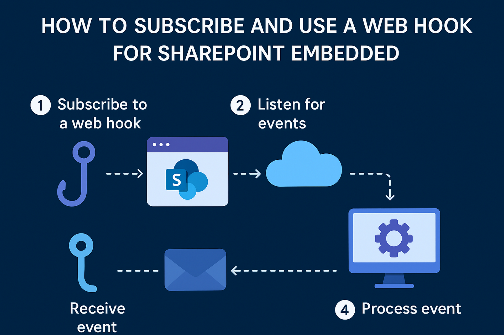

# Overview

To create a webhook for SharePoint Embedded, follow these general steps:

1. Register your webhook endpoint: Create a publicly accessible HTTP endpoint that can receive notifications from SharePoint Embedded. This endpoint should handle validation requests and process incoming webhook events.

2. Subscribe to SharePoint Embedded events: Use the Graph API to register your webhook. Provide your endpoint URL and specify the resource and events you want to monitor.

3. Handle validation requests: When you register the webhook, SharePoint Embedded sends a validation token to your endpoint. Your endpoint must echo this token back to confirm ownership.

4. Process notifications: When an event occurs, SharePoint Embedded sends a POST request to your endpoint with event details. Parse and handle these notifications as needed.

5. Renew and manage subscriptions: Webhook subscriptions expire after a set period. Monitor expiration and renew subscriptions as necessary.

# Pre requisites

To get started, there are a few things that need to be configured:

## Node.js
The examples in this project use node.js to monitor a specific port.

## Grah API Permissions
The following graph API permissions should be added to your app registration with delegated permissions.

Files.Read.All
Stires.Manage.All
Sites.Read.All

# Files in this solution
There a only 3 files that makeup this solution that should be used in your environment.
- .env - this is used to hold environment variables.
- package.json - essentially the app manifest where you can modify the port to listen on and the domain for the webhook
- server.js - this is the main file that will monitor events raised by the web hook and allows you to process them accordinly.

# Create a subscription for the webhook

## Update the environment variables
Update the .env file with the environment variables.

## Start the listener
- Start node.js which will start the server.js file.  This will be necessary to create the initial subscription.

        npm start
    
## Expose a local tunnel
To subscribe to an event from your SharePoint Embedded container, you need to expose the tunnel you are listening to.  During the subscription process, it will use this to register the webhook.

        npm run tunnel

## Register the web hook
Now that Node.js is listening on the correct port, you are ready to subscribe the web hook to the container you want to listen for events.

Use the following graph endpoint to subscribe to a webhook on your container:

You will need the proper delegated bearer token for the App Registration, which should be added to your .env file.

        POST https://graph.microsoft.com/v1.0/subscriptions

Reqauest Body

                Body:
                {
                  "changeType": "updated",
                  "notificationUrl": "https://spwebhookdemo.loca.lt/webhook",
                  "resource": "drives/b!NVgisi_AoESWYQEwvEKsqQ9XOA2z29xDpQpHxL_mhiOaKrcj63TzRq-06mOt_T5S/root",
                  "expirationDateTime": "2025-08-27T11:00:00.000Z",
                  "clientState": "secretClientValue"
        }

#### Note:
- **changeType** - Specify the [changeType](https://learn.microsoft.com/en-us/graph/api/resources/changenotification?view=graph-rest-1.0) for the web hook.
- **notificationUrl** - This is configured in the .env and package files.
- **resource** - input the container ID you want to monitor.
- **exirationType** - The max possible expiration time of 4230 minutes from the current time
- **clientState** - Setting the property allows your service to confirm that change notifications you receive originate from Microsoft Graph. For this reason, the value of the property should remain secret and known only to your application and the Microsoft Graph service.

This will return back a 201 Created response.

# Listen for events
Now that the web hook has subscribed to events at the container, when an event is raised, the response will be put into the command window to view.

Simply start listening by running:

        npm start
    
In this example, when a change happens to a file, you will see the change information in the output window.  In a production environment, you would capture and process the event reponse.